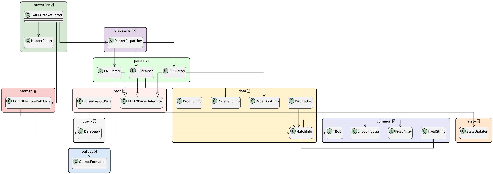
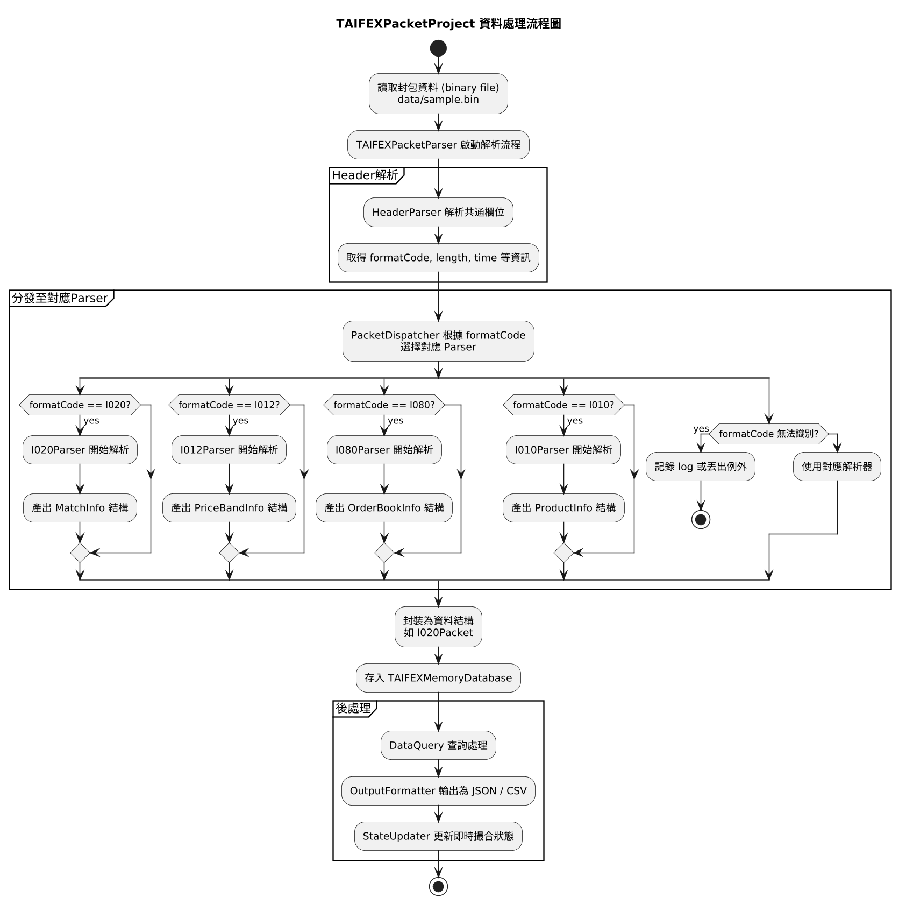

完整資訊在 https://github.com/squirrel1209/TAIFEXPacketParser.git

# 🧠 TAIFEXPacketProject

TAIFEXPacketProject 是專為台灣期交所（TAIFEX）封包格式所打造的高效能封包解析系統。支援解析多格式封包（I010、I012、I020、I080），並將期貨/選擇權資料分別輸出為 8 個 CSV 檔，適用於市場資料監控、交易系統前置處理等應用。


## ✅ 一. 功能總覽

| 功能                  | 說明                                          |
|-----------------------|---------------------------------------------|
| 撮合成交資料解析      | 解析 I020，取得商品代碼、價格、數量、時間     |
| 漲跌幅資訊解析        | 解析 I012，取得商品的漲跌停區間                |
| 委託簿快照解析        | 解析 I080，取得五檔買賣盤價格與數量             |
| 商品基本資料解析      | 解析 I010，取得商品代碼與交割日                 |
| 多格式分流儲存        | 按格式/商品類型 (期貨/選擇權) 輸出為 8 個 CSV  |
| 擴充性設計            | 易於新增新格式 Parser，支援多執行緒處理 (WIP)    |

---

## 📜 二.資料表 (使用 `unordered_map` 儲存容器)

### 1. `MatchInfo`（撥合資訊：I020）

> 儲存於：
> `std::unordered_map<std::string, std::vector<MatchInfo>> matchInfoMap;`
> 🔍 可依 `productId` 快速查找每個商品的歷史撥合紀錄

| 欄位名稱        | 型態     | 說明           |
| ----------- | ------ | ------------ |
| productId   | string | 商品代碼         |
| matchTime   | int    | 成交時間（HHMMSS） |
| matchPrice  | double | 成交價格         |
| matchVolume | int    | 成交數量（口數）     |
| buySellFlag | char   | 買賣方向（B/S）    |

---

### 2. `PriceBandInfo`（漲跌停資訊：I012）

> 儲存於：
> `std::unordered_map<std::string, std::vector<PriceBandInfo>> priceBandMap;`
> 🔍 可依商品代碼查找每個時間點的多階漲跌停區間設定

| 欄位名稱       | 型態     | 說明         |
| ---------- | ------ | ---------- |
| productId  | string | 商品代碼       |
| limitLevel | int    | 階數（第幾層漲跌停） |
| raiseLimit | double | 漲停價格       |
| fallLimit  | double | 跌停價格       |

---

### 3. `OrderBookInfo`（五樓資訊：I080）

> 儲存於：
> `std::unordered_map<std::string, std::vector<OrderBookInfo>> orderBookMap;`
> 🔍 可依商品代碼追蹤時間序列的買賣掛單變化

| 欄位名稱          | 型態        | 說明   |
| ------------- | --------- | ---- |
| productId     | string    | 商品代碼 |
| updateTime    | int       | 資料時間 |
| bidPrice\[5]  | double\[] | 五樓買價 |
| bidVolume\[5] | int\[]    | 五樓買量 |
| askPrice\[5]  | double\[] | 五樓賣價 |
| askVolume\[5] | int\[]    | 五樓賣量 |

---

### 4. `ProductInfo`（商品基本資訊：I010）

> 儲存於：
> `std::unordered_map<std::string, ProductInfo> productInfoMap;`
> 🔍 可直接查詢特定商品的名稱與交割月份（靜態資料）

| 欄位名稱          | 型態     | 說明   |
| ------------- | ------ | ---- |
| productId     | string | 商品代碼 |
| productName   | string | 商品名稱 |
| deliveryMonth | string | 交割月份 |


## 🧩 三.UML 模組關聯圖（實體圖）



---

## 🔄 四.資料處理流程圖



---

# 📄 五.輸出入格式

檔案格式 : .CSV檔

---

## ✅ I020 撮合資訊

### 對應結構：`MatchInfo`

| CSV 欄位     | 型態     | 說明         | 結構欄位     |
|--------------|----------|--------------|--------------|
| `time`       | int      | 成交時間     | `matchTime`  |
| `productId`  | string   | 商品代碼     | `productId`  |
| `price`      | double   | 成交價格     | `matchPrice` |
| `volume`     | int      | 成交口數     | `matchVolume`|

---

## ✅ I012 漲跌幅資訊

### 對應結構：`PriceBandInfo`

| CSV 欄位       | 型態   | 說明           | 結構欄位      |
|----------------|--------|----------------|---------------|
| `productId`    | string | 商品代碼       | `productId`   |
| `limitLevel`   | int    | 第幾階漲跌停   | `limitLevel`  |
| `limitPrice`   | double | 漲停價格（如有）| `raiseLimit`  |

> 備註：`fallLimit` 可另行輸出或合併顯示

---

## ✅ I080 委託簿快照（簡化版）

### 對應結構：`OrderBookInfo`

| CSV 欄位       | 型態     | 說明         | 結構欄位        |
|----------------|----------|--------------|-----------------|
| `time`         | int      | 資料時間     | `updateTime`    |
| `productId`    | string   | 商品代碼     | `productId`     |
| `bidPrice1`    | double   | 第一檔買價   | `bidPrice[0]`   |
| `bidVolume1`   | int      | 第一檔買量   | `bidVolume[0]`  |
| `askPrice1`    | double   | 第一檔賣價   | `askPrice[0]`   |
| `askVolume1`   | int      | 第一檔賣量   | `askVolume[0]`  |

---

## ✅ I010 商品基本資訊

### 對應結構：`ProductInfo`

| CSV 欄位        | 型態       | 說明       | 結構欄位        |
|-----------------|------------|------------|-----------------|
| `productId`     | string     | 商品代碼   | `productId`     |
| `name`          | string     | 商品名稱   | `productName`   |
| `deliveryMonth` | string/int | 交割月份   | `deliveryMonth` |

---

### 📂 輸出檔案位置

```
output/
├── Fut_I010.csv
├── Fut_I012.csv
├── Fut_I020.csv
├── Fut_I080.csv
├── Opt_I010.csv
├── Opt_I012.csv
├── Opt_I020.csv
└── Opt_I080.csv
```

使用以下函式匯出：

```cpp
OutputFormatter::exportToCSV(database, "output/");
```


## 📁 專案結構總覽

```
TAIFEXPacketProject/
├── data/                       # 📂 測試用二進位封包檔 (如 Fut.bin / Opt.bin)
├── doc/                        # 📂 專案文件與圖表資料
│   ├── 資料處理流程圖.txt       # 處理流程文字說明
│   ├── 系統物件關係.txt         # 系統關聯關係說明
│   ├── data_flowchart.png       # 資料處理流程圖
│   ├── system_diagram.png       # 系統架構圖
│   ├── 多執行緒.png            # 多執行緒說明圖
│   ├── 單執行緒.png            # 單執行緒說明圖
│   └── 資訊傳輸作業手冊(V2.29.1).pdf # 官方作業手冊
├── include/                    # 📂 標頭檔 (header files)
│   ├── base/                   # 抽象類別與介面
│   ├── common/                 # 固定長度結構工具
│   ├── controller/             # 主解析流程控制
│   ├── data/                   # 封包資料結構 (Header + Body)
│   ├── dispatcher/             # 封包分發邏輯
│   ├── output/                 # 結果輸出 (JSON / CSV)
│   ├── parser/                 # 各格式 payload 解析器
│   ├── protocol/               # 封包通用欄位 (Header)
│   └── storage/                # 記憶體內資料庫
├── src/                        # 📂 對應 .cpp 檔案實作
├── CMakeLists.txt              # 🔧 CMake 編譯設定
├── README.md                   # 專案說明文件
└── main.cpp                    # 測試整合主程式
```

## 📦 已支援封包格式

| 格式代碼 | 封包名稱           | 狀態     |
|----------|--------------------|----------|
| I020     | 撮合資訊           | ✅ 已完成 |
| I012     | 漲跌幅資訊         | ✅ 已完成 |
| I080     | 委託簿快照資訊     | ✅ 已完成 |
| I010     | 商品基本資訊       | ✅ 已完成 |

---

## 🧪 執行方式與測試資料

請放置測試檔案於 `data/` 目錄，例如：

```
data/sample.bin
```

並使用以下步驟建置與執行：

```bash
mkdir build && cd build
cmake ..
make
./TAIFEXMain
```

主程式將讀取 `sample.bin`、解析封包，並輸出資訊至 console 或儲存至資料庫物件。

---


## 👨‍💻 開發者筆記

- 所有解析結構盡量符合 POD（Plain Old Data）設計，方便記憶體 mapping 與高速處理。
- 使用 `FixedArray`, `FixedString`, `TBCD` 等工具實現封包位元對齊、BCD 編碼處理。
- 實作時可優先測試單一格式（如 I020），再逐步擴充解析支援。

---

