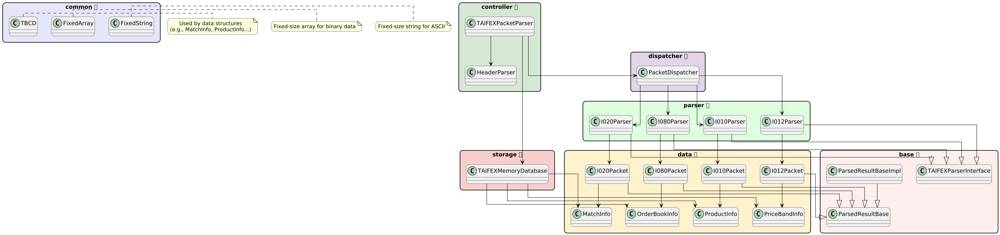

完整資訊在 https://github.com/squirrel1209/TAIFEXPacketParser.git

# 🧠 TAIFEXPacketProject

TAIFEXPacketProject 是一個專為台灣期交所（TAIFEX）封包格式所打造的高效能封包解析系統。專案具有模組化結構，支援多格式（如 I020、I012、I080、I010）解析、記憶體內資料庫管理、以及可擴展的查詢與輸出介面，適合用於市場資料監控、交易系統前處理等應用場景。


## ✅ 功能項目總覽

| 功能                     | 說明                                           |
|--------------------------|------------------------------------------------|
| 即時查看撮合成交資訊     | 從 I020 取得商品、價格、數量、時間            |
| 查看商品漲跌停區間       | 從 I012 得知商品的上下限價格                  |
| 查詢委託簿深度          | 從 I080 顯示五檔買賣價格與數量                |
| 顯示商品基本資料          | 從 I010 取得商品名稱與交割月份                |
| 條件查詢                | 可依商品代碼、時間區間查詢特定資料            |
| 輸出報表                | 匯出查詢結果為 JSON / CSV，供系統後續分析     |
---

## 📜 資料表 (使用 `unordered_map` 儲存容器)

### 1. `MatchInfo`（撥合資訊：I020）

> 儲存於：
> `std::unordered_map<std::string, std::vector<MatchInfo>> matchInfoMap;`
> 🔍 可依 `productId` 快速查找每個商品的歷史撥合紀錄

| 欄位名稱        | 型態     | 說明           |
| ----------- | ------ | ------------ |
| productId   | string | 商品代碼         |
| matchTime   | int    | 成交時間（HHMMSS） |
| matchPrice  | double | 成交價格         |
| matchVolume | int    | 成交數量（口數）     |
| buySellFlag | char   | 買賣方向（B/S）    |

---

### 2. `PriceBandInfo`（漲跌停資訊：I012）

> 儲存於：
> `std::unordered_map<std::string, std::vector<PriceBandInfo>> priceBandMap;`
> 🔍 可依商品代碼查找每個時間點的多階漲跌停區間設定

| 欄位名稱       | 型態     | 說明         |
| ---------- | ------ | ---------- |
| productId  | string | 商品代碼       |
| limitLevel | int    | 階數（第幾層漲跌停） |
| raiseLimit | double | 漲停價格       |
| fallLimit  | double | 跌停價格       |

---

### 3. `OrderBookInfo`（五樓資訊：I080）

> 儲存於：
> `std::unordered_map<std::string, std::vector<OrderBookInfo>> orderBookMap;`
> 🔍 可依商品代碼追蹤時間序列的買賣掛單變化

| 欄位名稱          | 型態        | 說明   |
| ------------- | --------- | ---- |
| productId     | string    | 商品代碼 |
| updateTime    | int       | 資料時間 |
| bidPrice\[5]  | double\[] | 五樓買價 |
| bidVolume\[5] | int\[]    | 五樓買量 |
| askPrice\[5]  | double\[] | 五樓賣價 |
| askVolume\[5] | int\[]    | 五樓賣量 |

---

### 4. `ProductInfo`（商品基本資訊：I010）

> 儲存於：
> `std::unordered_map<std::string, ProductInfo> productInfoMap;`
> 🔍 可直接查詢特定商品的名稱與交割月份（靜態資料）

| 欄位名稱          | 型態     | 說明   |
| ------------- | ------ | ---- |
| productId     | string | 商品代碼 |
| productName   | string | 商品名稱 |
| deliveryMonth | string | 交割月份 |


## 🧩 UML 模組關聯圖（實體圖）



---

## 🔄 資料處理流程圖


---

## 📁 專案結構總覽

```
TAIFEXPacketProject/
├── CMakeLists.txt              # 🔧 CMake 建置設定
├── data/                       # 📂 測試用二進位封包檔
├── include/                    # 📁 所有標頭檔 (.h)
│   ├── base/                   # 🌱 抽象類別與介面
│   ├── common/                 # 🔧 固定長度結構工具
│   ├── protocol/               # 🧾 封包通用欄位（Header）
│   ├── controller/             # 🎮 主解析流程控制
│   ├── dispatcher/             # 📨 封包分發邏輯
│   ├── parser/                 # 🧩 各格式 payload 解析器
│   ├── data/                   # 📊 封包資料結構（封裝 header + body）
│   ├── storage/                # 💾 記憶體內資料庫
│   ├── output/                 # 🖨️ 結果輸出（JSON / CSV）
│   ├── query/                  # 🔍 查詢模組（供 API/GUI 使用）
│   └── state/                  # 🔁 即時狀態追蹤模組
├── src/                        # 📂 對應 .cpp 檔案
└── main.cpp                    # 🧪 測試整合主程式
```

---

## 🔧 功能模組說明

| 模組名稱              | 說明 |
|-----------------------|------|
| `TAIFEXPacketParser`  | 驅動整體封包流程，包含 HeaderParser 與 Dispatcher |
| `HeaderParser`        | 擷取封包格式代碼與時間等共通欄位 |
| `PacketDispatcher`    | 根據格式代號（如 I020）分發至對應 `Parser` 類別 |
| `I020Parser`          | 撮合資訊格式（I020）之 payload 解碼器 |
| `MatchInfo`           | 撮合資訊欄位結構（數據對應欄位定義） |
| `TAIFEXMemoryDatabase`| 儲存所有解析結果，提供查詢與輸出來源 |
| `OutputFormatter`     | 將資料庫結果輸出為 JSON / CSV 檔 |
| `DataQuery`           | 查詢模組，支援商品代碼、時間區間查詢等 |
| `StateUpdater`        | 即時撮合狀態追蹤，可支援圖形化顯示模組 |

---

## 📦 已支援封包格式

| 格式代碼 | 封包名稱           | 狀態     |
|----------|--------------------|----------|
| I020     | 撮合資訊           | ✅ 已完成 |
| I012     | 漲跌幅資訊         | 🚧 開發中 |
| I080     | 委託簿快照資訊     | 🚧 開發中 |
| I010     | 商品基本資訊       | 🕓 計劃中 |

---

## 🧪 執行方式與測試資料

請放置測試檔案於 `data/` 目錄，例如：

```
data/sample.bin
```

並使用以下步驟建置與執行：

```bash
mkdir build && cd build
cmake ..
make
./TAIFEXMain
```

主程式將讀取 `sample.bin`、解析封包，並輸出資訊至 console 或儲存至資料庫物件。

---

## 📌 擴充與客製化設計

此專案設計時即考慮：

- ✅ 支援多封包格式並可快速擴充 `parser/` 與 `data/`
- ✅ 封裝解析邏輯與資料結構，提升重用性與可測試性
- ✅ 可串接至 API、GUI 查詢模組
- ✅ 可擴充為即時 socket 串流解析架構（WIP）

---

## 📚 延伸模組建議

| 模組名稱        | 功能構想                              |
|-----------------|---------------------------------------|
| `SocketReceiver`| 建立 socket server，自動接收封包串流 |
| `TimeSeriesDB`  | 接上 MongoDB / TimescaleDB 儲存歷史數據 |
| `MetricsModule` | 統計指標模組（如最大/最小/均值等）     |

---

## 👨‍💻 開發者筆記

- 所有解析結構盡量符合 POD（Plain Old Data）設計，方便記憶體 mapping 與高速處理。
- 使用 `FixedArray`, `FixedString`, `TBCD` 等工具實現封包位元對齊、BCD 編碼處理。
- 實作時可優先測試單一格式（如 I020），再逐步擴充解析支援。

---


# 📄 輸出入格式

此文件說明每個封包格式的資料結構（定義於 `.h` 檔案）如何對應到實際輸出的 CSV 欄位。

---

## ✅ I020 撮合資訊

### 對應結構：`MatchInfo`

| 結構欄位     | CSV 欄位     | 型態     | 說明             |
|--------------|--------------|----------|------------------|
| `matchTime`  | `time`       | int      | 成交時間         |
| `productId`  | `productId`  | string   | 商品代碼         |
| `matchPrice` | `price`      | double   | 成交價格         |
| `matchVolume`| `volume`     | int      | 成交口數         |

---

## ✅ I012 漲跌幅資訊

### 對應結構：`PriceBandInfo`

| 結構欄位      | CSV 欄位       | 型態   | 說明               |
|---------------|----------------|--------|--------------------|
| `productId`   | `productId`    | string | 商品代碼           |
| `limitLevel`  | `limitLevel`   | int    | 第幾階漲跌停       |
| `raiseLimit`  | `limitPrice`   | double | 漲停價格（如有）   |

> 備註：若有跌停價格 `fallLimit`，可能另做輸出或合併顯示。

---

## ✅ I080 委託簿快照（簡化輸出）

### 對應結構：`OrderBookInfo`

| 結構欄位         | CSV 欄位         | 型態     | 說明         |
|------------------|------------------|----------|--------------|
| `updateTime`     | `time`           | int      | 資料時間     |
| `productId`      | `productId`      | string   | 商品代碼     |
| `bidPrice[0]`    | `bidPrice1`      | double   | 第一檔買價   |
| `bidVolume[0]`   | `bidVolume1`     | int      | 第一檔買量   |
| `askPrice[0]`    | `askPrice1`      | double   | 第一檔賣價   |
| `askVolume[0]`   | `askVolume1`     | int      | 第一檔賣量   |

> 備註：簡化版本僅輸出第一檔，完整版本可依需求展開 bid/ask 1~5。

---

## ✅ I010 商品基本資訊

### 對應結構：`ProductInfo`

| 結構欄位        | CSV 欄位        | 型態       | 說明         |
|-----------------|-----------------|------------|--------------|
| `productId`     | `productId`     | string     | 商品代碼     |
| `productName`   | `name`          | string     | 商品名稱     |
| `deliveryMonth` | `deliveryMonth` | string/int | 交割月份     |

---


### 📂 輸出檔案位置

```
output/
├── I020.csv
├── I012.csv
├── I080.csv
└── I010.csv
```

使用以下函式匯出：

```cpp
OutputFormatter::exportToCSV(database, "output/");
```